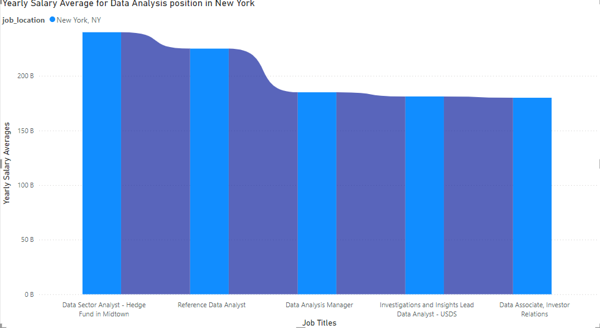
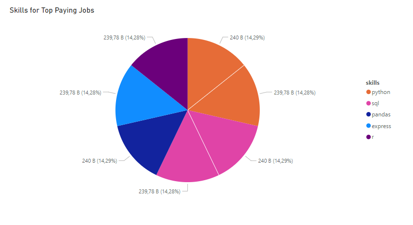
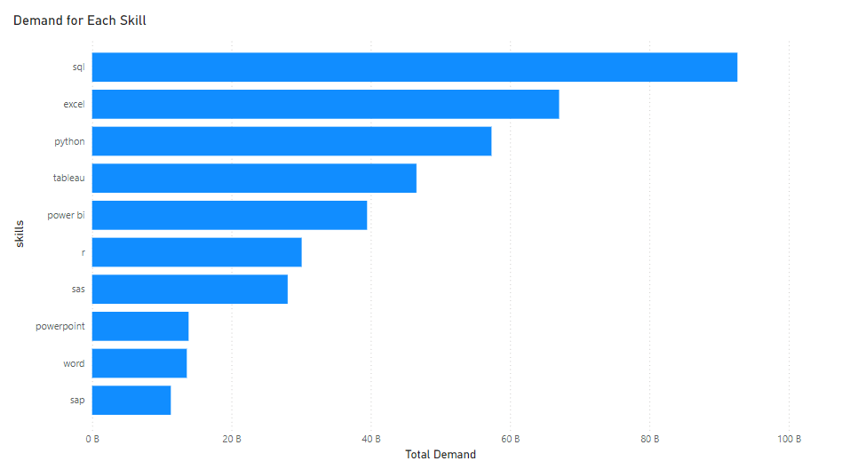
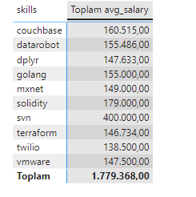
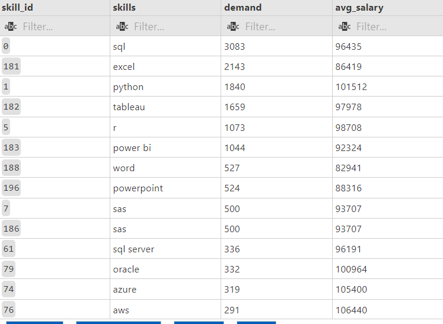

# Introduction:Data Field Job Market Analysis
In this project, I conducted a comprehensive data analysis of job market demands and salaries within the data field, utilizing SQL and Power BI. The primary objectives were to identify key trends in job demands, analyze salary distributions, and provide insightful visualizations to aid decision-making.

Key Components:
Data Extraction and Transformation:

Utilized SQL for extracting relevant data from multiple tables.
Applied various SQL functions and techniques, including:
Joins: To combine data from different tables based on related columns.
Subqueries: For complex filtering and aggregation operations.
Common Table Expressions (CTEs): For improving query readability and simplifying complex queries.
Job Market Demand Analysis:

Identified the most in-demand skills for data-related job titles.
Aggregated job postings to determine demand levels for specific skills.
Filtered data to include only relevant job titles and postings with non-null salary information.
Salary Analysis:

Calculated average salaries for various skills within the data field.
Rounded salary figures to enhance clarity in reporting.
Combined salary data with demand metrics to provide a holistic view of the job market.
Data Visualization with Power BI:

Created interactive dashboards to visualize job market trends and salary distributions.
Implemented filters to allow users to drill down into specific data subsets.
Used visual elements like charts, graphs, and tables to present data insights effectively.

# Tools Have Used
-SQL
-PostgreSQL
-Visual Studio Code
-Git&Github
-PowerBI (visualization), .pbix files are attached in assets folder.
## 1- Yearly Salary Average for Data Analysis position in New York
    ''' SELECT job_id,
        job_title,
        job_location,
        job_schedule_type,
        salary_year_avg,
        job_posted_date,
        name AS company_name

    FROM job_postings_fact AS job
    LEFT JOIN company_dim AS cp ON job.company_id = cp.company_id
    WHERE
    job_title_short = 'Data Analyst' AND
    job_location = 'New York, NY' AND
    salary_year_avg IS NOT NULL
    ORDER BY salary_year_avg DESC
'''

*Graph visualizing the salary for the top 7 salaries for data analysis role in New York.Created by PowerBI from Sql  queries from Postgre server.
## 2- Top Skills for Income
    WITH top_paying_jobs AS (
        SELECT job_id,
        job_title,
        salary_year_avg,
        name AS company_name

        FROM job_postings_fact AS job
        LEFT JOIN company_dim AS cp ON job.company_id = cp.company_id
        WHERE
        job_title_short = 'Data Analyst' AND
        job_location = 'New York, NY' AND
        salary_year_avg IS NOT NULL
        ORDER BY salary_year_avg DESC
    )
    SELECT top_paying_jobs.*,skills_dim.skills
    FROM top_paying_jobs
    INNER JOIN skills_job_dim ON skills_job_dim.job_id= top_paying_jobs.job_id
    INNER JOIN skills_dim ON skills_dim.skill_id= skills_job_dim.skill_id
    ORDER BY salary_year_avg DESC 
   

**Graph visualizing the market rates for the top 7 incomes for each skills.Created by PowerBI from Sql  queries from Postgre server.

## 3- In-Demand Skills for Data Analysts
    SELECT skills_dim.skills, COUNT(skills_job_dim.job_id) as demand
    FROM job_postings_fact
    INNER JOIN skills_job_dim ON skills_job_dim.job_id=  job_postings_fact.job_id
    INNER JOIN skills_dim ON skills_dim.skill_id= skills_job_dim.skill_id
    WHERE job_title_short = 'Data Analyst'
    GROUP BY skills 
    ORDER BY demand DESC

## 4- Skills Based on Salary
    SELECT skills_dim.skills,  ROUND (AVG(salary_year_avg),0) AS avg_salary
    FROM job_postings_fact
    INNER JOIN skills_job_dim ON skills_job_dim.job_id=  job_postings_fact.job_id
    INNER JOIN skills_dim ON skills_dim.skill_id= skills_job_dim.skill_id
    WHERE job_title_short = 'Data Analyst' AND
    salary_year_avg IS NOT NULL
    GROUP BY skills 
    ORDER BY avg_salary DESC

## 5- Optimal Skills to Learn
    WITH skills_demand AS (
        SELECT skills_dim.skill_id, skills_dim.skills, COUNT(skills_job_dim.job_id) as demand
        FROM job_postings_fact
        INNER JOIN skills_job_dim ON skills_job_dim.job_id = job_postings_fact.job_id
        INNER JOIN skills_dim ON skills_dim.skill_id = skills_job_dim.skill_id
        WHERE job_postings_fact.job_title_short = 'Data Analyst' AND
        job_postings_fact.salary_year_avg IS NOT NULL
        GROUP BY skills_dim.skill_id, skills_dim.skills
    ), average_salary AS (
        SELECT skills_dim.skill_id, skills_dim.skills, ROUND(AVG(job_postings_fact.salary_year_avg), 0) AS avg_salary
        FROM job_postings_fact
        INNER JOIN skills_job_dim ON skills_job_dim.job_id = job_postings_fact.job_id
        INNER JOIN skills_dim ON skills_dim.skill_id = skills_job_dim.skill_id
        WHERE job_postings_fact.job_title_short = 'Data Analyst' AND
        job_postings_fact.salary_year_avg IS NOT NULL
        GROUP BY skills_dim.skill_id, skills_dim.skills
    )
    SELECT skills_demand.skill_id, 
        skills_demand.skills, 
        skills_demand.demand, 
        average_salary.avg_salary
    FROM skills_demand
    INNER JOIN average_salary ON skills_demand.skill_id = average_salary.skill_id
    ORDER BY skills_demand.demand DESC;
 
 

